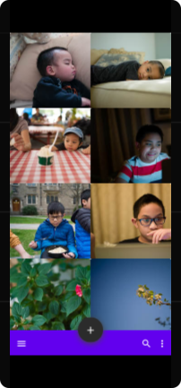
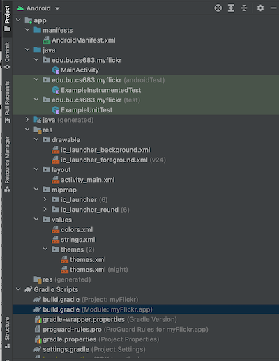

# myFlickr: An Alternative Flickr Mobile App

Dexter Legaspi (dlegaspi@bu.edu)  
BU MET MSSD

- [Overview](#overview)
- [Related Work](#related-work)
  * [Essential](#essential)
  * [Desirable](#desirable)
  * [Optional](#optional)
- [Requirement Analysis and Testing](#requirement-analysis-and-testing)
- [Design and Implementation](#design-and-implementation)
  * [Basic Architecture](#basic-architecture)
  * [UI Design and Implementation](#ui-design-and-implementation)
  * [Third-Party APIs](#third-party-apis)
  * [Data Design and Implementation](#data-design-and-implementation)
- [Project Structure](#project-structure)
- [Timeline](#timeline)
- [Future Work (Optional)](#future-work--optional-)
- [Lessons Learned](#lessons-learned)
  * [Iteration 0](#iteration-0)
- [References](#references)

## Overview

I have been an avid photographer since I was in high school when my mother purchased my first Pentax SLR.  The advent of digital technology lending itself to the advancement of photography has further helped on improving my craft since I also work in the computer field.  There are a million applications (desktop and mobile alike) for photography and I have benefitted from most of them, and I would like to pay it forward with a contribution of my own for anyone who wants to improve in their craft.

Flickr is one of the first established and popular photography websites, and have been instrumental with my learning finding images of other people around the world.  Flickr is a photography website, but it is more geared towards the social aspects of it: followers, groups and sharing of images.  These are important, but it is equally important to look at one's own catalog without the noise, and see how he/she has improved.  This is the focus the app: hence the name "myFlickr":  to focus on **my** images and have a fresh perspective on them.  It would have the usual images viewer but the browser would be more optimized for quick browsing with the metadata (which the official app doesn't do today); there will be minimal features geared towards the social/sharing and more tools to filter and inspect your own images--e.g., there will be search and filtering based on the metadata of the images

## Building the project

The project uses Gradle, and issuing the `gradle build` command should suffice in building the app.  However, prior to building the application, it will require to have the Flickr API key in the `gradle.properties` file:  

```properties
flickr.api.key=$YOUR_API_KEY
flickr.api.secret=$YOUR_SECRET_KEY
```

## Related Work

### Essential 
 
The essential features of the application will revolve around being able to authenticate and retrieve the images of the authenticated user.  The authentication requires interfacing with a relatively antiquated OAuth 1.0a authentication scheme of the Flickr API.  In addition, the core functionaly, of course, is to be able to show all the images of the user, either in individual mode or in a grid.  When viewing the individual image, the user should be able to optionally see the overlay of the image metadata.

### Desirable

With regards to the image viewing and presentation, it would be desirable to have as much options as possible: it would be nice to have a split view of the images where one can have a film strip view of the images on the bottom half and then the selected image on the top and also be able to optionally group the images based on the metadata.

### Optional

It would be nice to have some push notifications for any likes or increased views but it will be very low on the totem pole of features to be implemented and will only be there time permitting.

## Requirement Analysis and Testing 


|Title(Essential/Desirable/Optional) | Authentication (Essential) |
|---|---|
|Description|As a user, I will be able to authenticate using my existing Flickr credentials  |
|Mockups| |
|Acceptance Tests| User will be able to log in using Flickr credentials and have the opportunity to authorize the app to access his/her account and images |
|Test Results| TBD |
|Status| Iteration 1: Integrated with Flickr OAuth API|

| Title(Essential/Desirable/Optional)| View Images as Grid (Essential) |
|---|---|
|Description|As a user, I should be able to have an option to view all my images in my account as a grid |
|Mockups| |
|Acceptance Tests| User can display all of his/her images in a grid|
|Test Results| TBD |
|Status| |

| Title(Essential/Desirable/Optional)| View Images as Individual (Essential) |
|---|---|
|Description|As a user, I should be able to have an option to view all my images in my account individually with the option of having the metadata as overlay |
|Mockups|  |
|Acceptance Tests| User can display all of his/her images individually with metadata optionally as overlay|
|Test Results| TBD |
|Status| |


## Design and Implementation

### Basic Architecture

The application will (likely) follow the traditional [Model-View-View-Model Design Pattern](https://www.geeksforgeeks.org/mvvm-model-view-viewmodel-architecture-pattern-in-android/) and will be relying on [Dependency Injection](https://developer.android.com/training/dependency-injection) to minimize coupling of components.

### UI Design and Implementation  
 
 The UI design will be very minimal; it will try to mimic looking at a photo lightbox as much as possible.  There will be menu that will be out of the way most of the time to maximize the screen real estate for viewing the images.

### Third-Party APIs

As mentioned, we are going to leverage a lot of the Flickr API and this will be made possible by using third party libraries like [Flickr4Java](https://github.com/boncey/Flickr4Java) and [ScribeJava](https://github.com/scribejava/scribejava).  We are also going to leverage the use of HTTP/REST libraries like [OkHttp](https://square.github.io/okhttp/).  We will try to incorporate [Dagger](https://github.com/google/dagger) which simplifies automatic dependency injection without putting a lot of overhead.

### Data Design and Implementation

A lot of the data will come via the Flickr API and will certainly leverage the available methods to get the images and metadata and it search aspects.  The rest will be using a local database (SQLite) for more efficient filtering of metadata.

## Project Structure

This is the initial directory structure of the project.  It only has the basic classes and artifacts that are generated using Android Studio IDE.  The Gradle script has been modified to add Third Party License references and Spotless plugin.





## Timeline

|Iteration | Application Requirements (Eseential/Desirable/Optional) | Android Components and Features| 
|---|---|---|
|1|Authentication and Basic Image Browsing | Using Network connectivity and WebView for OAuth Handshake, using Flickr REST APIs|
|2| | |
|3| | |
|4| | |
|5| | |

## Future Work (Optional)
*(This section can describe possible future works. Particularly the requirements you planned but didn’t get time to implement, and possible Android components or features to implement them. 
This section is optional, and you can include this section in the final iteration if you want.)*
    
##Project Demo Links
*(For on campus students, we will have project presentations in class. For online students, you are required to submit a video of your project presentation which includes a demo of your app. You can use Kaltura to make the video and then submit it on blackboard. Please check the following link for the details of using Kaltura to make and submit videos on blackboard. You can also use other video tools and upload your video to youtube if you like: https://onlinecampus.bu.edu/bbcswebdav/courses/00cwr_odeelements/metcs/cs_Kaltura.htm  )*

## Lessons Learned

### Iteration 0
- OAuth 1.0a integration is difficult nowadays because most implementations are in 2.x.  Unfortunately, Flickr API is using 1.x   
- I learned that Since Android 3, apps cannot execute network-related tasks in the UI thread, which prompted me to having to learn about `AsyncTask` (which apparently has been recently deprecated) to geth the OAuth integration to work.  

## References

- [Flickr API Documentation](https://www.flickr.com/services/api/)
- [OAuth 1.0a](https://oauth.net/core/1.0a/)